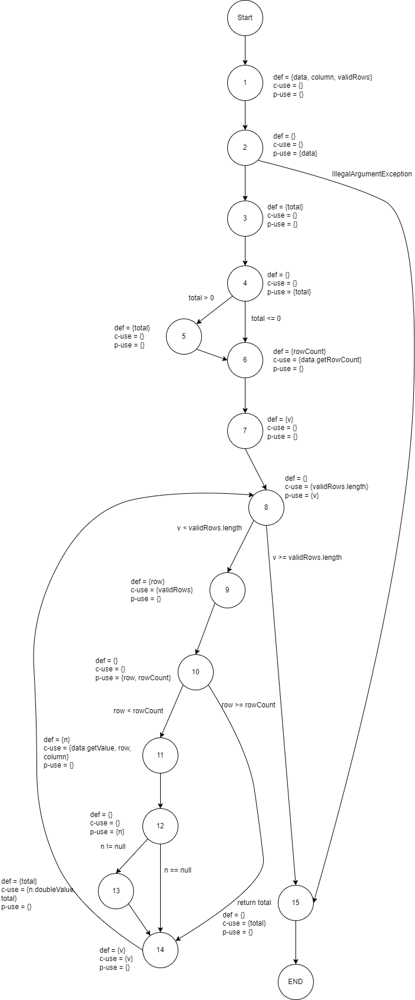
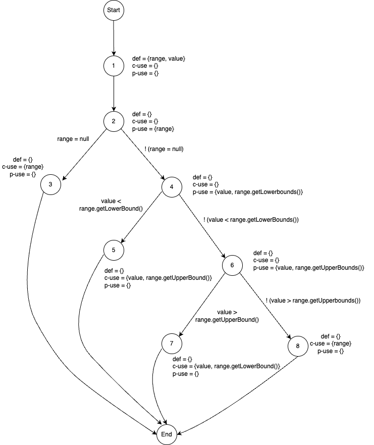
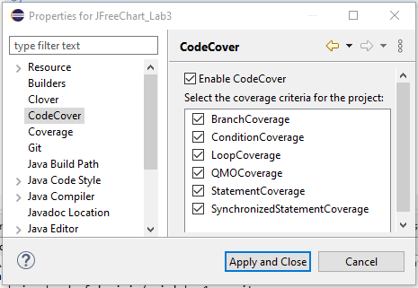
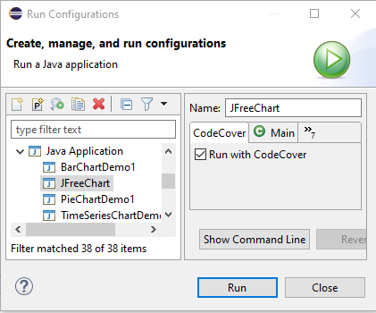
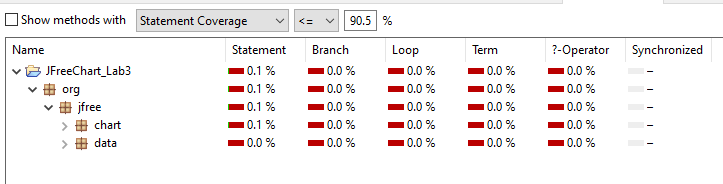

**SENG 637 - Dependability and Reliability of Software Systems**

**Lab. Report #3 – Code Coverage, Adequacy Criteria and Test Case Correlation**

| Group: 10       | 
|-----------------|
| Amey Brahme     |   
| Tejpreet Bal    |   
| Dhananjay Roy   |   
| Harshil Patel   |   
| Munal Akhtar    |   

(Note that some labs require individual reports while others require one report
for each group. Please see each lab document for details.)

# 1 Introduction

This assignment aims to develop our understanding of assessing the effectiveness of a white-box test suite through code coverage. It builds on the automated unit testing principles from Assignment 2, using the JUnit tool in Eclipse. Unlike Assignment 2, here we focus on enhancing the test suite and creating test cases based on various white-box testing criteria, including control flow (statement, decision, condition, and method coverage) and data flow (DU pairs coverage). Implementing white-box testing allows us to validate unit tests at the unit testing level. The coverage tools also identify the extent of completed unit testing and highlight areas that require attention. Overall, white-box testing facilitates a more thorough and in-depth testing phase in the software development cycle by examining all possible code paths.

# 2 Manual data-flow coverage calculations for X and Y methods

  2.1. DataUtilities.calculateColumnTotal(Values2D data, int column, int[] validRows)

  The three-argument calculateColumnTotal method was chosen out of the two methods with the same name. The following are
  the steps and calculations to calculate the all-uses coverage for this method.

  Data Flow Graph:

  

Defs, Uses and DU Pairs

|                |                                                           |
| -------------- | ----------------------------------------------------------| 
| defs:          | def(1) = {data, column, validRows}                        |     
|                | def(3) = {total}                                          |
|                | def(5) = {total}                                          |
|                | def(6) = {rowCount}                                       |
|                | def(7) = {v}                                              |
|                | def(9) = {row}                                            |
|                | def(11) = {n}                                             |
|                | def(13) = {total}                                         |
|                | def(14) = {v}                                             |
| uses:          | use(2) = (data}                                           |
|                | use(4) = {total}                                          |
|                | use(6) = {data}                                           |
|                | use(8) = {validRows, v}                                   |
|                | use(9) = {validRows}                                      |
|                | use(10) = {row, rowCount}                                 |
|                | use(11) = {data, row, column}                             |
|                | use(12) = {n}                                             |
|                | use(13) = {n, total}                                      |
|                | use(14) = {v}                                             |
|                | use(15) = {total}                                         |
| du-pairs       |                                                           |
| for data:      | (1, 2), (1, 6), (1, 11)                                   |
| for column:    | (1, 11)                                                   |
| for validRows: | (1, 8), (1, 9)                                            |
| for total:     | (3, 4), (3, 5) (3,13), (3, 15), (5, 13), (5, 15), (13, 15) |
| for rowCount:  | (6, 10)                                                   |
| for v:         | (7, 8), (7, 14), (14, 8), (14, 14)                        |
| for row:       | (9, 10), (9, 11)                                          |
| for n:         | (11, 12), (11, 13)                                        |

Defs, c-use and p-use pairs by variable for coverage calculation

| Variable  | Def at node n | dcu(v, n) | dpu(v, n)            |
| --------- | ------------- | --------- | -------------------- |
| data      | 1             | {6, 11}   | {(2, 3), (2, 15)}    |
| column    | 1             | {11}      | {}                   |
| validRows | 1             | {9}       | {(8, 9), (8, 15)}    |
| total     | 3             | {13}      | {(4, 5), (4, 6)}     |
| total     | 5             | {13}      | {}                   |
| total     | 13            | {13}      | {}                   |
| rowCount  | 6             | {}        | {(10, 11), (10, 14)} |
| v         | 7             | -         | -                    |
| v         | 14            | {14}      | {(8, 9), (8, 15)}    |
| row       | 9             | {11}      | {(10, 11), (10, 14)) |
| n         | 11            | {}        | {(12, 13), (12, 14)} |
|           | Total         | CU = 9    | PU = 14              |

DU Pair Per test case:

| Test Case                                | DU-pairs covered                                                                                                                           
| -------------------------------------------------- | ------------------------------------------------ | 
|calculateColumnTotalThreeArgsForAllRows()|(1, 2), (1, 6), (1, 11), (1, 8), (1, 9), (3, 4), (3, 5) (3,13), (3, 15), (5, 13), (5, 15), (13, 15), (6, 10), (7, 8), (7, 14), (14, 8), (9, 10), (9, 11), (11, 12), (11, 13)|
|calculateColumnTotalThreeArgsLBRow()|(1, 2), (1, 6), (1, 8), (1, 9), (1, 11), (3, 4), (3, 13), (3, 15), (6, 10), (7, 8), (7, 14), (14, 8), (14, 14), (9, 10), (9, 11), (11, 12)|
|calculateColumnTotalThreeArgsForTwoRows()|(1, 2), (1, 6), (1, 8), (1, 9), (1, 11), (3, 4), (3, 13), (3, 15), (6, 10),(7, 8), (7, 14), (14, 8), (14, 14), (9, 10), (9, 11), (11, 12)|
|calculateColumnTotalThreeArgsUPBRow()|(1, 2), (1, 6), (1, 8), (1, 9), (1, 11), (3, 4), (3, 13), (3, 15), (6, 10), (7, 8), (7, 14), (14, 8), (14, 14), (9, 10), (9, 11), (11, 12)|
|calculateColumnTotalThreeArgsRowUBValue()|(1, 2), (1, 6), (1, 11), (1, 8), (1, 9), (3, 4), (3, 5) (3,13), (3, 15), (5, 13), (5, 15), (13, 15), (6, 10), (7, 8), (7, 14), (14, 8), (9, 10), (9, 11), (11, 12), (11, 13)|
|calculateColumnTotalThreeArgsRowUBValueAndLBValue()|(1, 2), (1, 6), (1, 8), (1, 9), (1, 11), (3, 4), (3, 13), (3, 15), (6, 10), (7, 8), (7, 14), (14, 8), (14, 14), (9, 10), (9, 11), (11, 12)|
|calculateColumnTotalThreeArgsRowOneLBValue()|(1, 2), (1, 6), (1, 11), (1, 8), (1, 9), (3, 4), (3, 5) (3,13), (3, 15), (5, 13), (5, 15), (13, 15), (6, 10), (7, 8), (7, 14), (14, 8), (9, 10), (9, 11), (11, 12), (11, 13)|
|calculateColumnTotalThreeArgsOneBUBValues()|(13, 15), (6, 10), (7, 8), (7, 14), (14, 8), (9, 10), (9, 11), (11, 12), (11, 13), (1, 2), (1, 6), (1, 8), (1, 9), (1, 11), (3, 4), (3, 13),|
|calculateColumnTotalThreeArgsOneALBValues()|(1, 2), (1, 6), (1, 8), (1, 9), (1, 11), (3, 4), (3, 13), (3, 15), (6, 10), (7, 8), (7, 14), (14, 8), (14, 14), (9, 10), (9, 11), (11, 12)|
|calculateColumnTotalThreeArgsColumnTwo()|(13, 15), (6, 10), (7, 8), (7, 14), (14, 8), (9, 10), (9, 11), (11, 12), (11, 13), (1, 2), (1, 6), (1, 8), (1, 9), (1, 11), (3, 4), (3, 13),|
|calculateColumnTotalThreeArgsAllZeroValues()|(1, 2), (1, 6), (1, 11), (1, 8), (1, 9), (3, 4), (3, 5) (3,13), (3, 15), (5, 13), (5, 15), (13, 15), (6, 10), (7, 8), (7, 14), (14, 8), (9, 10), (9, 11), (11, 12), (11, 13)|
|calculateColumnTotalThreeArgsInvalidRowArray()|(1, 2), (1, 6), (1, 8), (1, 9), (1, 11), (3, 4), (3, 13), (3, 15), (6, 10), (7, 8), (7, 14), (14, 8), (14, 14), (9, 10), (9, 11), (11, 12)|

2.2. Range.expandToInclude(Range range, double value)

Class: Range
Function: ExpandToInclude: The following are
the steps and calculations to calculate the all-uses coverage for this method.

Defs, user and du-pairs

| defs:         | def(1) = {range, value}                             |
| ------------- | --------------------------------------------------- |
| uses:         | use(2) = {range}                                    |
|               | use(3) = {range}                                    |
|               | use(4) = {range, value}                             |
|               | use(5) = {range, value}                             |
|               | use(6) = {range.value}                              |
|               | use(7) = {range.value}                              |
|               | use(8) = {range}                                    |
| du-pairs:     | for range: (1,2), (1,3), (1,4), (1,5), (1,6), (1,8) |
|               | For value: (1,4), (1,5), (1,6)                      |
| DataUtilities | getCumulativePercentages()                          |

Du-pari coverage calculatino per test case

| Variable | Def at node (n) | dcu(v,n)     | dpu(v,n)                                   |
| -------- | --------------- | ------------ | ------------------------------------------ |
| range    | 1               | {3, 5, 7, 8} | {(2,3), (2,4), (4,5), (4,6), (6,7), (6,8)} |
| value    | 1               | {5, 7}       | {(4,5), (4,6), (6,7), (6,8)}               |
|          |                 | CU = 6       | PU = 10                                    |

| Test Case                                | DU-pairs covered                                                                                                                           
| -------------------------------------------------- | ------------------------------------------------ | 
|testExpandToInclude_nullRange()|(1,2), (1,4)|
|testExpandToInclude_valueBelowRange()|(1,2), (1,3), (1,4), (1,5), (1,6), (1,8)|
|testExpandToInclude_valueAboveRange()|(1,2), (1,3), (1,4), (1,5), (1,6), (1,8)|
|testExpandToInclude_valueWithinRange()|(1,2), (1,3), (1,4), (1,5), (1,6), (1,8)|
|testExpandToInclude_valueAtLowerBound()|(1,2), (1,3), (1,4), (1,5), (1,8)|
|testExpandToInclude_valueAtUpperBound()|(1,2), (1,3), (1,4), (1,5), (1,6), (1,8)|
|testExpandToInclude_NaNValue()|(1,2), (1,4)|

# 3 A detailed description of the testing strategy for the new unit test

The overarching testing approach for this assignment involved utilizing EclEmma on the initial set of Assignment 2 tests designed for the source code within the Assignment 3 artifacts. Upon obtaining coverage results for the 'before' state from the code coverage tool, we proceeded to enhance or supplement the existing tests for the selected 10 methods identified in Assignment 2. These methods are: 

Range

- `expandToInclude(Range range, double value)`
- `expand(Range range, double lowerMargin, double upperMargin)`
- `intersects(double b0, double b1)`
- `shift(Range base, double delta, boolean allowsZeroCrossing)`
- `scale(Range base, double factor)`

DataUtilities

- `calculateColumnTotal(Values2D data, int column, int[] validRows)`
- `calculateRowTotal(Values2D data, int row, int[] validCols)`
- `createNumberArray(double[] data)`
- `createNumberArray2D(double[][] data)`
- `getCumulativePercentages(KeyedValues data)`

The following is the list of new methods covered.

Range

- `combine(Range range1, Range range2)`
- `combineIgnoringNaN(Range range1, Range range2)`
- `constrain(double value)`
- `contains(double value)`
- `equals(Object obj)`
- `getCentralValue()`
- `getLength()`
- `getLowerBound()`
- `getUpperBound()`
- `hashCode()`
- `intersects(Range range)`
- `isNaNRange()`
- `shift(Range base, double delta)`

DataUtilities

- `calculateColumnTotal(Values2D data, int column)`
- `calculateRowTotal(Values2D data, int row)`
- `clone(double[][] source)`
- `equal(double[][] a, double[][] b)`

The overarching strategy employed during the creation of new unit tests involved a systematic process. We initiated by running the code coverage tool, visually analyzing the coverage results, and subsequently crafting a test that targeted a line, branch, or condition lacking coverage. Following the development of a new unit test, we reran the code coverage tool to assess the impact of the test on coverage. Test development for a specific method concluded once satisfactory coverage was achieved for that method. Similarly, unit test writing for an entire class was deemed complete upon achieving overall coverage for the class. Periodic revisions to unit tests were undertaken as necessary.

# 4 A high level description of five selected test cases you have designed using coverage information, and how they have increased code coverage

Range

1 Testing Intersections Under Varied Conditions:

Overlapping Ranges: Confirms the intersects method correctly identifies when two ranges overlap, addressing both forward and reverse order inputs.
Non-Overlapping Ranges: Verifies the method correctly identifies when two ranges do not overlap, enhancing branch coverage by ensuring conditions leading to a false outcome are tested.
Single-Point Range Intersecting: Tests a special case where one of the ranges is a single-point range (both bounds are the same), and it intersects with another range.
Adjacent but Non-Overlapping Ranges: Tests the edge case where two ranges are adjacent but do not overlap, increasing condition coverage by testing boundaries of intersection logic.

Testing Intersections with Overlapping Ranges:
@Test
public void testIntersects_overlappingRanges() {
    Range range1 = new Range(-2, 2);
    Range range2 = new Range(-1, 3);
    assertTrue(range1.intersects(range2.getLowerBound(), range2.getUpperBound()));
}

Testing Intersections with Non-Overlapping Ranges:
@Test
public void testIntersects_nonOverlappingRanges() {
    Range range1 = new Range(-5, -2);
    Range range2 = new Range(1, 4);
    assertFalse(range1.intersects(range2.getLowerBound(), range2.getUpperBound()));
}

2 Combining Ranges Ignoring NaN:

Tests combining ranges where one or both ranges include NaN values, improving coverage by ensuring the method correctly handles NaN according to its documented behavior. This includes scenarios where one range is null, both are null, one has NaN bounds, and even when valid bounds are combined with NaN bounds.

@Test
public void testCombineIgnoringNaN_oneRangeNull() {
    Range range1 = null;
    Range range2 = new Range(3, 7);
    Range combinedRange = Range.combineIgnoringNaN(range1, range2);
    assertNotNull(combinedRange);
    assertEquals(3, combinedRange.getLowerBound(), 1e-9);
    assertEquals(7, combinedRange.getUpperBound(), 1e-9);
}

3 Range Expansion with Negative, Zero, and Positive Margins:

These tests ensure the expand method behaves correctly when provided with negative margins (contracting the range), zero margins (leaving the range unchanged), and positive margins (expanding the range). This thorough testing increases statement and condition coverage by verifying all possible code paths through the method.

@Test(expected = IllegalArgumentException.class)
public void testScale_negativeFactor() {
    Range baseRange = new Range(1, 6);
    Range.scale(baseRange, -2); // This action should throw IllegalArgumentException
}

4 Testing Shift Operations with Various Conditions:

Tests shifting a range with positive and negative deltas, with and without allowing the range to cross zero. This includes scenarios where shifting would normally result in negative bounds but zero-crossing is prevented, ensuring both the functionality and error handling of the shift operations are correctly implemented.

@Test(expected = IllegalArgumentException.class)
public void testScale_negativeFactor() {
    Range baseRange = new Range(1, 6);
    Range.scale(baseRange, -2); // This action should throw IllegalArgumentException
}

5 Scaling Ranges with Different Factors:

Introduces tests for scaling ranges by a factor, including edge cases such as scaling by zero (which should result in a range from zero to zero), and scaling with NaN, which tests the method's robustness and error handling.

@Test
public void testShiftWithNoZeroCrossing_negativeDelta() {
    Range range = new Range(2, 12);
    Range result = Range.shift(range, -3, false);
    assertEquals(0, result.getLowerBound(), 1e-9); // Ensures lower bound does not cross zero
    assertEquals(9, result.getUpperBound(), 1e-9); // Upper bound is correctly shifted
}

Data Utilities

1 Testing Column Totals with Max Values:

This test case examines how calculateColumnTotal handles a scenario where one of the values is the maximum integer value, testing the method's ability to accurately calculate totals without integer overflow.

@Test
public void calculateColumnTotalForOneMaxValue() {
    mockingContext.checking(new Expectations() {{
        one(values).getRowCount(); will(returnValue(2));
        one(values).getValue(0, 0); will(returnValue(Integer.MAX_VALUE));
        one(values).getValue(1, 0); will(returnValue(2.0));
    }});
    double result = DataUtilities.calculateColumnTotal(values, 0);
    assertEquals(Integer.MAX_VALUE + 2.0, result, 0.000000001d);
}

2 Testing Column Totals with Min Values:

Similar to the max value test but with minimum integer values. It's crucial for understanding how the method deals with potential underflow issues.

@Test
public void calculateColumnTotalForOneMinValue() {
    mockingContext.checking(new Expectations() {{
        one(values).getRowCount(); will(returnValue(2));
        one(values).getValue(0, 0); will(returnValue(-Integer.MAX_VALUE));
        one(values).getValue(1, 0); will(returnValue(10));
    }});
    double result = DataUtilities.calculateColumnTotal(values, 0);
    assertEquals(10 - Integer.MAX_VALUE, result, 0.000000001d);
}

3 Testing Column Totals with a Combination of Min and Max Values:

This test case further pushes the boundaries by combining maximum and minimum integer values in the same column, ensuring that the method can handle extreme value variations.

@Test
public void calculateColumnTotalForOneoMinOneMaxValue() {
    mockingContext.checking(new Expectations() {{
        one(values).getRowCount(); will(returnValue(2));
        one(values).getValue(0, 0); will(returnValue(-Integer.MAX_VALUE));
        one(values).getValue(1, 0); will(returnValue(Integer.MAX_VALUE));
    }});
    double result = DataUtilities.calculateColumnTotal(values, 0);
    assertEquals(0, result, 0.000000001d);
}

4 Testing Column Totals Just Above Lower Bound:

Focusing on edge cases, this test examines the method's accuracy for a value just above the integer minimum, which is critical for validating the calculation's precision near boundary values.

@Test
public void calculateColumnTotalForALB() {
    mockingContext.checking(new Expectations() {{
        one(values).getRowCount(); will(returnValue(2));
        one(values).getValue(0, 0); will(returnValue(1 - Integer.MAX_VALUE));
        one(values).getValue(1, 0); will(returnValue(0));
    }});
    double result = DataUtilities.calculateColumnTotal(values, 0);
    assertEquals(1 - Integer.MAX_VALUE, result, 0.000000001d);
}

5 Testing Column Totals Just Below Upper Bound:

Similar to the above, but for values just below the integer maximum, ensuring that calculations remain accurate even at the edge of the integer range.

@Test
public void calculateColumnTotalForBUB() {
    mockingContext.checking(new Expectations() {{
        one(values).getRowCount(); will(returnValue(2));
        one(values).getValue(0, 0); will(returnValue(1));
        one(values).getValue(1, 0); will(returnValue(Integer.MAX_VALUE - 1));
    }});
    double result = DataUtilities.calculateColumnTotal(values, 0);
    assertEquals(Integer.MAX_VALUE, result, 0.000000001d);
}

# 5 A detailed report of the coverage achieved of each class and method (a screen shot from the code cover results in green and red color would suffice)

### Range - Before

- Line Coverage

- Branch Coverage

- Method Coverage

### Range Coverage - After

- Line Coverage

- Branch Coverage

- Condition/Method Coverage

###DataUtilities Coverage - Before

- Line Coverage

- Branch Coverage

- Method Coverage

### DataUtilities Coverage - After

- Line Coverage

- Branch Coverage

- Condition/Method Coverage

# 6 Pros and Cons of coverage tools used and Metrics you report

The primary tool utilized for coverage analysis in this lab was EclEmma, a choice greatly influenced by its seamless integration with Eclipse—EclEmma is bundled with Eclipse, ensuring it operates effectively right out of the box. Despite its convenience, EclEmma has its limitations, offering only Method, Line, and Branch coverage metrics. This constraint limited our ability to explore additional coverage metrics that could have offered deeper insights into our testing completeness.

In our quest for more comprehensive coverage analysis, we also experimented with JaCoco. Our exploration revealed that EclEmma leverages JaCoco under the hood, as evidenced by the identical coverage metrics provided by both tools.

Our exploration extended to Codecover, a tool we anticipated would furnish us with the advanced metrics we sought. Despite our efforts, as illustrated in the screenshots provided, Codecover consistently failed to recognize our unit tests upon multiple executions. This issue significantly impeded our ability to obtain the desired coverage insights through Codecover.

**Enable codecover in project properties**

**Codecover Run Configuration**

**Codecover Results**

# 7 A comparison on the advantages and disadvantages of requirements-based test generation and coverage-based test generation.

### Requirements Based Testing

Requirements-based testing or black-box testing has the following advantages and disdvantages:

Advantages:
1. Reduced Implementation Bias: Since testing is based on requirements rather than the source code, there's less risk of bias towards the code's implementation, promoting a focus on the system's intended functionality.
2. Focus on User Requirements: Test cases are designed based on Javadoc, program specifications, or user stories, ensuring that testing is aligned with user requirements and expectations.
3. Simulates Real User Interaction: Without access to the source code, test cases may more accurately reflect real user interactions with the system, potentially uncovering usability issues.
4. Promotes Requirement Verification: Encourages thorough review and verification of requirements, as test cases directly correlate to documented requirements, ensuring all specified functionality is tested.
5. Flexibility in Test Implementation: Testers can employ various types of testing, such as functional testing, system testing, and acceptance testing, without needing detailed knowledge of the programming language or the system internals.

Disadvantages:
1. Challenges with Test Creation: Lack of access to the source code can make it difficult to design detailed tests or mocks, especially if the available specifications and documentation are unclear, ambiguous, or incomplete.
2. Difficulty in Assessing Test Adequacy: Without a quantifiable measure such as code coverage, determining whether the tests are comprehensive enough to ensure adequate coverage is challenging.
3. Potential Oversight of Logic Testing: There's a risk that the tests may not adequately reflect the program's logic, such as different branches or computational faults, due to the focus on external behaviors rather than internal logic.
4. Possibility of Missing Implementation-Specific Defects: Black-box testing might overlook defects that are specific to the code's implementation, as it does not scrutinize the internal workings of the application.
5. Risk of Redundancy and Inefficiency: Without insight into the code structure, there's a potential for creating redundant tests or failing to focus on critical areas, leading to inefficient testing efforts.

### Coverage Based Testing

Coverage-based testing or white-box testing has the following advantages and disadvantages:

Advantages:
1. Ease of Test Case Development: Having access to the source code simplifies the creation of test cases as it allows for a deeper understanding of the application's logic.
2. Thorough Logic Testing: Testers are more likely to identify and examine the logic and potential bugs within the code, as they can step through and scrutinize the code directly.
3. Quantifiable Metrics for Adequacy: Coverage metrics such as line coverage, branch coverage, or all-uses coverage provide a tangible means to report on testing completeness and determine adequacy using predefined thresholds.
4. Early Detection of Code Anomalies: Direct interaction with the source code enables early detection of defects, code smells, and optimization opportunities, which can lead to more efficient code.
5. Automation and Continuous Integration: Coverage-based testing can be easily automated and integrated into continuous integration pipelines, ensuring that coverage metrics are consistently maintained throughout the development lifecycle.

Disadvantages:
1. Potential Bias Toward Code Over Requirements: Testing based on the source code may inadvertently focus more on the code itself rather than on fulfilling the software requirements or meeting user expectations.
2. Possibility of Overlooking Important Cases: The pursuit of meeting coverage thresholds can lead to the neglect of critical test cases not covered by the threshold, especially if the focus is solely on achieving line coverage.
3. Difficulty with Infeasible Paths: Achieving complete coverage can be challenging due to the existence of infeasible paths within the software under test (SUT), and identifying these paths can be time-consuming and complex.
4. Insufficient Testing of Non-functional Requirements: Coverage-based testing primarily focuses on code structure, potentially neglecting non-functional requirements such as performance, usability, and security.
5. Requirement for Highly Skilled Testers: Effective white-box testing requires testers to have a deep understanding of the programming language and the system's internal workings, which may necessitate more specialized knowledge compared to black-box testing.
Choosing the right tool is crucial.

# 8 A discussion on how the team work/effort was divided and managed

After conducting initial tests with coverage, the tasks of writing additional tests for all methods in both classes were distributed among the team members. Upon completing the supplementary test cases, each member had the opportunity to review the test cases, offering feedback or creating new test cases as necessary. For manual coverage calculations, one team member undertook the task of performing the expandToInclude calculation, with another reviewing and contributing suggestions. 
Similarly, a different pair was responsible for the calculateColumnTotal (3 args) calculation, with one performing the calculation and the other reviewing and providing feedback. The task of report writing was a collaborative effort, with all members contributing to various sections via GitHub.com, using a Markdown (.md) file for documentation.

Please see the table below for the list of methods tested and members responsible for the respective methods for the new methods.
| Class | Method | Tester |
|---------------|----------------------|---------|
| Range | combine() | Munal |
| Range | combineIgnoringNaN() | Dhananjay |
| Range | constrain() | Amey |
| Range | contains() | Harshil |
| Range | equals(Object obj) | Tejpreet |
| Range | getCentralValue() | Tejpreet |
| Range | getLowerBound() | Munal |
| Range | getUpperBound() | Dhananjay |
| Range | hashCode() | Amey |
| Range | isNanRange() | Harshil |
| Range | shift() | Tejpreet |
| DataUtilities | calculateColumnTotal | Munal |
| DataUtilities | calculateRowTotal | Dhananjay |
| DataUtilities | clone() | Amey |
| DataUtilities | equal() | Harshil |

# 9 Any difficulties encountered, challenges overcome, and lessons learned from performing the lab

One of the most significant take ways from this assignment was that our tests, regardless of the testing approach, might not be sufficient to uncover all software bugs. As a result, it becomes crucial to assess the coverage of our test cases over the System Under Test (SUT) code. Some challenges we faced were with coverage tools not being easily integrated with Eclipse.
# We noticed that our tests were not able to cover code for the 2nd loop in the method named "getCumulativePercentages(KeyedValues data)" in DataUtilities class. This is because logical bug/ defect in the code provided. Due to reasons similar to this were unable to achieve more than 90 % line coverage.

# 10 Comments/feedback on the lab itself

This lab provided valuable insights as we explored code coverage tools for the first time. We experimented with these tools, uncovering both their benefits and challenges. Notably, we recognized that relying solely on tests without considering coverage is insufficient. By thoroughly reviewing our previous work, we improved our approach.

During this process, we honed our skills in writing tests to achieve high coverage. While the experience of writing additional tests was beneficial, we identified room for improvement. Specifically, clarifying in the readme that certain methods should be the primary focus (rather than the entire class) would enhance future efforts.

Overall, this lab emphasized the importance of comprehensive testing and the role of coverage analysis in ensuring robust software.
